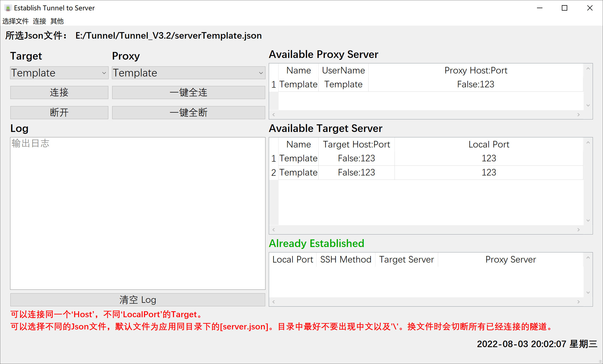

# Tunnel-Connector
构建一个隧道连接器，外网通过隧道连接到内网资源。

测试发现，隧道的存活时间为2小时。

注意，即使隧道死亡，不会报错，自动断开以及重连。

主界面：

|  目录   | 简述  |
|  ----  | ----  |
| other  | 测试基本功能的实现 |
| V1  | Version1，在界面中实现基本功能 |
| V2  | Version2，加入文件，配置文件，增删改功能 |
| V3  | Version3，打包成可执行文件 |
| V4  | Version4，加入监听存活状态（未完成） |
| release  | 可执行版本，Version3.2 |

# TODO
- [x] 将信息存入文件，并可以加载不同的文件
- [x] 添加配置文件
- [x] 增删改功能
- [x] 重要字符串加密
- [x] 打包成可执行文件
- [x] 主页中显示可以使用的服务器信息
- [ ] 监听存活状态，如果断开，自动重连
- [ ] 组件优化

